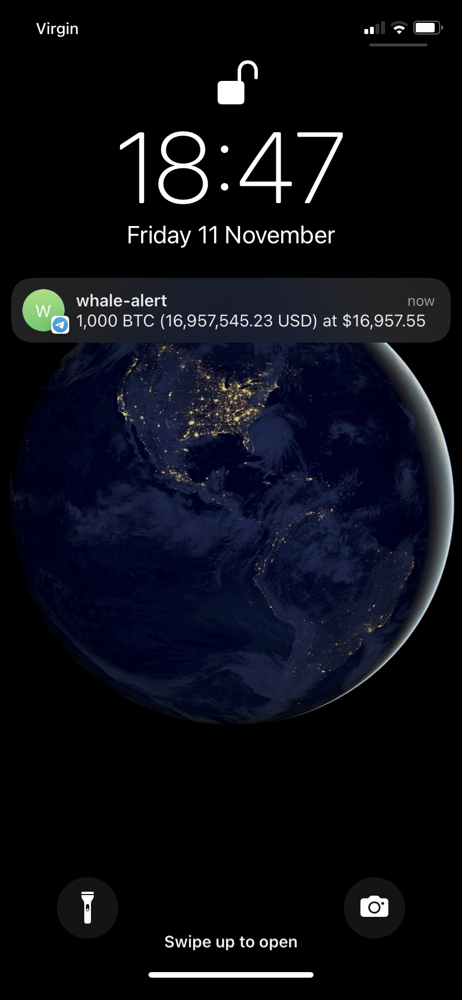

# Whale-Alert
This script will enable you to track a crypto whale's activity by notifying you on telegram about any new transaction performed by their address.

- It uses BotFather (A built-in Telegram bot that helps users create custom Telegram bots) to setup a bot to send messages.
- BeautifulSoup to web-scrape information from BitInfoChart (website to retrieve a specific address' activity).
- Runs every 10 minutes and checks whether a new block was added in the latest activity in order to send a notification on telegram.

## Setup telegram bot

### 1. Create A Telegram Bot Using Telegram’s BotFather

- Open your telegram app and search for BotFather. (A built-in Telegram bot that helps users create custom Telegram bots).
- Type /newbot to create a new bot.
- Give your bot a name & a username.
- Copy your new Telegram bot’s token into the script.

### 2. Getting your chat ID

- Send your Telegram bot a message (any random message)
- Run this Python script to find your chat ID;
```
import requests
TELEGRAM_TOKEN = "YOUR TELEGRAM BOT TOKEN"
url = f"https://api.telegram.org/bot{TELEGRAM_TOKEN}/getUpdates"
print(requests.get(url).json())
```

This script calls the getUpdates function, which kinda checks for new messages. You can find your chat ID from the returned JSON.

Note: if you don’t send your Telegram bot a message, your results might be empty.

## Running the script

- Replace the `TELEGRAM_TOKEN` and `TELEGRAM_CHAT_ID` variables with your values gotten in the bot setup stage. Best practice is to add them as environment variables in your .zshrc or .bashrc and use `os.environ.get()` in the code to read them.
- Specify which bitcoin address you want to listen to in the `BITCOIN_ADDRESS` variable.
- Use `TIME_DELAY` to decide how often to check for an update, defaulted to every 10 minutes (Note: notification will only be sent if there was a new transaction).
- See the image below of an example notification:

[](img/notification.png)


## TODO
- Add a cronjob instead of running the application constantly.
- Turn this into a web application to make the user-experience better and make the script available to non-tech users.
